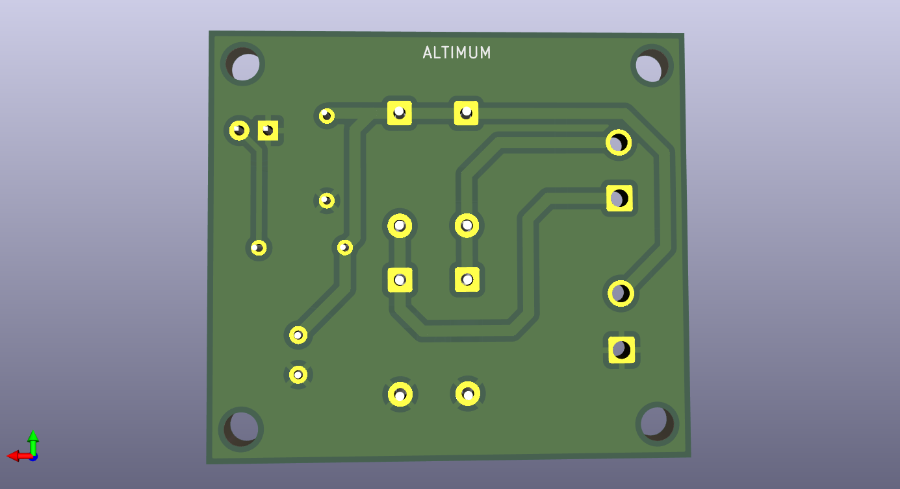

# AC to DC Converter PCB Design using KICAD -ALTIMUM
## PCB TOP VIEW

## PCB BOTTOM VIEW

## Project Overview
This project is an AC to DC converter circuit designed to convert alternating current (AC) input into a stable direct current (DC) output. The circuit uses a transformer to step down the input voltage, a bridge rectifier to convert AC to pulsating DC, and a filter capacitor to smooth the output. It demonstrates the basic principles of power supply design and provides a reliable DC source suitable for low-voltage electronic applications. This is my first KiCad project, created to learn schematic design and understand the fundamentals of circuit development
